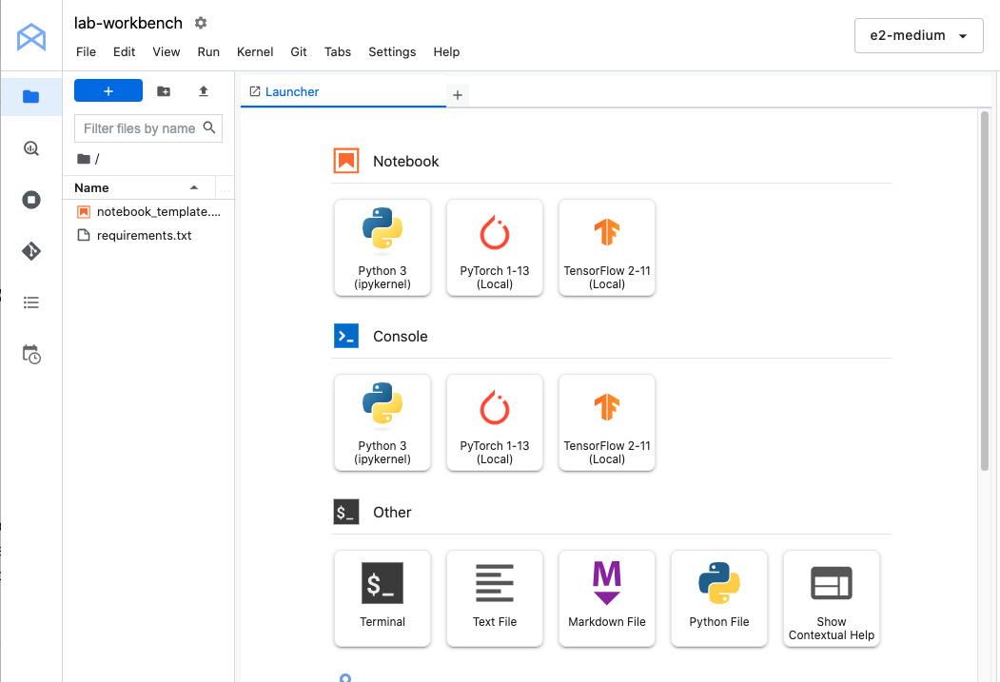
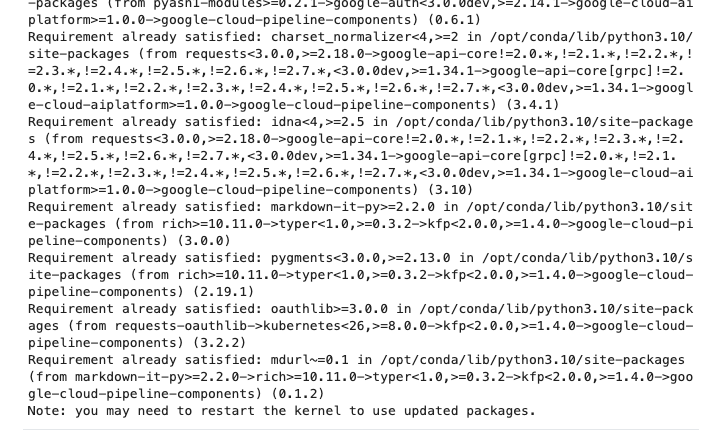
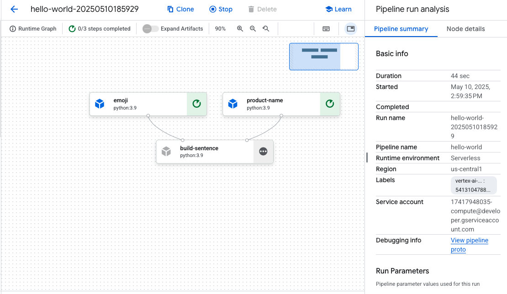
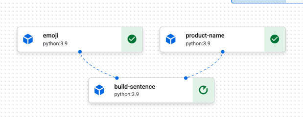
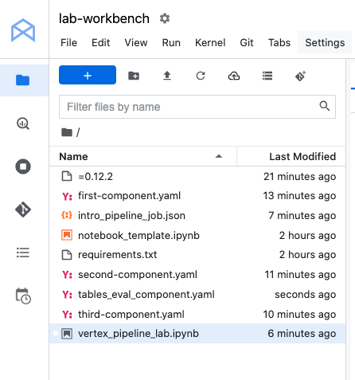
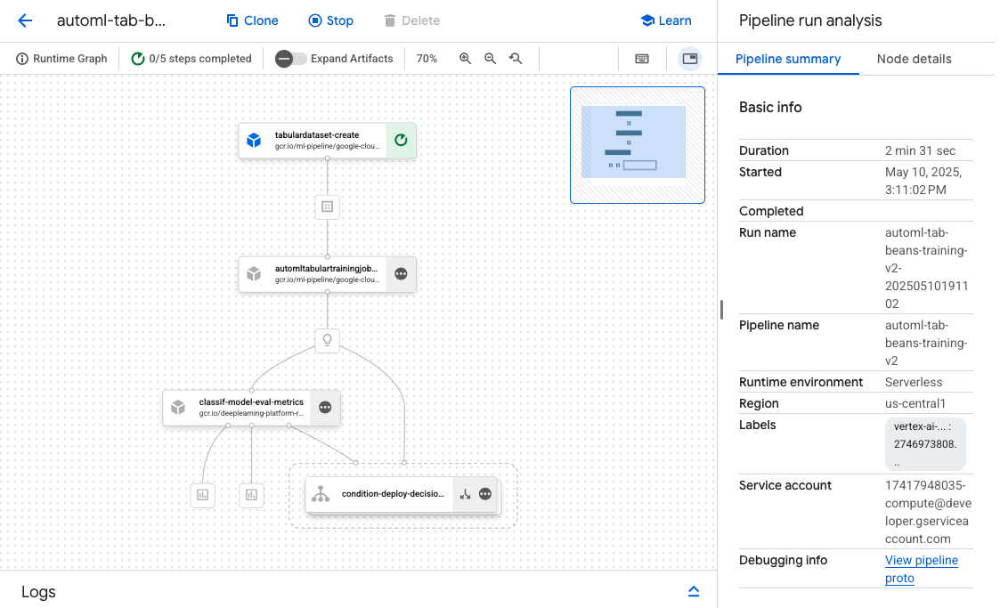
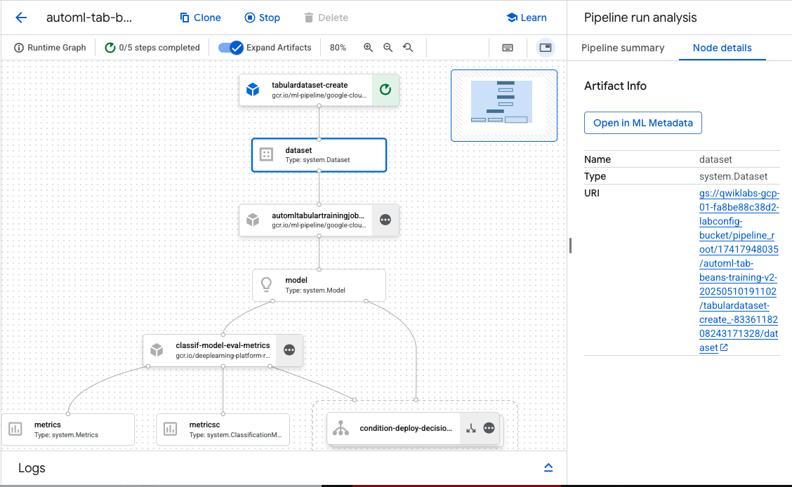

# GCP-LAB-Vertex-AI-Pipelines-Qwik-Start
Vertex AI Pipelines: Qwik Start


#### Overview
Pipelines help you automate and reproduce your ML workflow. Vertex AI integrates the ML offerings across Google Cloud into a seamless development experience. Previously, models trained with AutoML and custom models were accessible via separate services. Vertex AI combines both into a single API, along with other new products. Vertex AI also includes a variety of MLOps products, like Vertex AI Pipelines. In this lab, you will learn how to create and run ML pipelines with Vertex AI Pipelines

###### Why are ML pipelines useful?

Before diving in, first understand why you would want to use a pipeline. Imagine you're building out an ML workflow that includes processing data, training a model, hyperparameter tuning, evaluation, and model deployment. Each of these steps may have different dependencies, which may become unwieldy if you treat the entire workflow as a monolith. As you begin to scale your ML process, you might want to share your ML workflow with others on your team so they can run it and contribute code. Without a reliable, reproducible process, this can become difficult. With pipelines, each step in your ML process is its own container. This lets you develop steps independently and track the input and output from each step in a reproducible way. You can also schedule or trigger runs of your pipeline based on other events in your Cloud environment, like when new training data is available.

##### Objectives
In this lab, you learn how to:

. Use the Kubeflow Pipelines SDK to build scalable ML pipelines
. Create and run a 3-step intro pipeline that takes text input
. Create and run a pipeline that trains, evaluates, and deploys an AutoML classification model
. Use pre-built components for interacting with Vertex AI services, provided through the google_cloud_pipeline_components library
. Schedule a pipeline job with Cloud Scheduler

### Task 1. Open the notebook in Vertex AI Workbench

1. In the Google Cloud console, on the Navigation menu (Navigation menu icon), click Vertex AI > Workbench.

2. Find the lab-workbench instance and click on the Open JupyterLab button.

The JupyterLab interface for your Workbench instance opens in a new browser tab.



### Task 2. Vertex AI Pipelines setup
There are a few additional libraries you'll need to install in order to use Vertex AI Pipelines:

. Kubeflow Pipelines: This is the SDK used to build the pipeline. Vertex AI Pipelines supports running pipelines built with both Kubeflow Pipelines or TFX.

. Google Cloud Pipeline Components: This library provides pre-built components that make it easier to interact with Vertex AI services from your pipeline steps.


##### Step 1: Create Python notebook and install libraries
1. Click the Python 3 icon to launch a new Python notebook.

2. Right-click on the Untitled.ipynb file in the menu bar and select Rename Notebook to give it a meaningful name.

3. To install both services needed for this lab, first set the user flag in a notebook cell:

```
USER_FLAG = "--user"
```

4. Then run the following from your notebook:

```
%pip install $USER_FLAG google-cloud-aiplatform==1.59.0
%pip install $USER_FLAG kfp google-cloud-pipeline-components==0.1.1 --upgrade
%pip uninstall -y shapely pygeos geopandas
%pip install shapely==1.8.5.post1 pygeos==0.12.0 geopandas>=0.12.2
%pip install google-cloud-pipeline-components
```
>Note: You will see warnings and errors regarding versions, which you can safely ignore.



5. After installing these packages you'll need to restart the kernel:

```
import os

if not os.getenv("IS_TESTING"):
    # Automatically restart kernel after installs
    import IPython

    app = IPython.Application.instance()
    app.kernel.do_shutdown(True)
```

6. Finally, check that you have correctly installed the packages. The KFP SDK version should be >=1.6:

```
!python3 -c "import kfp; print('KFP SDK version: {}'.format(kfp.__version__))"
!python3 -c "import google_cloud_pipeline_components; print('google_cloud_pipeline_components version: {}'.format(google_cloud_pipeline_components.__version__))"
```

>KFP SDK version: 1.8.22
google_cloud_pipeline_components version: 0.1.1


##### Step 2: Set your project ID and bucket
Throughout this lab you'll reference your Cloud Project ID and the bucket you created earlier. Next you'll create variables for each of those.

. If you don't know your project ID you may be able to get it by running the following:

```
import os
PROJECT_ID = ""

# Get your Google Cloud project ID from gcloud
if not os.getenv("IS_TESTING"):
    shell_output=!gcloud config list --format 'value(core.project)' 2>/dev/null
    PROJECT_ID = shell_output[0]
    print("Project ID: ", PROJECT_ID)
```
>Project ID:  qwiklabs-gcp-01-fa8be88c38d2

2.Then create a variable to store your bucket name.

```
BUCKET_NAME="gs://" + PROJECT_ID + "-labconfig-bucket"
```

##### Step 3: Import libraries
. Add the following to import the libraries you'll be using throughout this lab:

```
from typing import NamedTuple

import kfp
from kfp import dsl
from kfp.v2 import compiler
from kfp.v2.dsl import (Artifact, Dataset, Input, InputPath, Model, Output,
                        OutputPath, ClassificationMetrics, Metrics, component)
from kfp.v2.google.client import AIPlatformClient

from google.cloud import aiplatform
from google_cloud_pipeline_components import aiplatform as gcc_aip
```

##### Step 4: Define constants
The last thing you need to do before building the pipeline is define some constant variables. PIPELINE_ROOT is the Cloud Storage path where the artifacts created by your pipeline will be written. You're using us-central1 as the region here, but if you used a different region when you created your bucket, update the REGION variable in the code below:

```
PATH=%env PATH
%env PATH={PATH}:/home/jupyter/.local/bin
REGION="us-central1"


PIPELINE_ROOT = f"{BUCKET_NAME}/pipeline_root/"
PIPELINE_ROOT
```
>env: PATH=/usr/local/cuda/bin:/opt/conda/bin:/opt/conda/condabin:/usr/local/bin:/usr/bin:/bin:/usr/local/games:/usr/games:/home/jupyter/.local/bin
'gs://qwiklabs-gcp-01-fa8be88c38d2-labconfig-bucket/pipeline_root/'

After running the code above, you should see the root directory for your pipeline printed. This is the Cloud Storage location where the artifacts from your pipeline will be written. It will be in the format of gs://<bucket_name>/pipeline_root/.


### Task 3. Creating your first pipeline
Create a short pipeline using the KFP SDK. This pipeline doesn't do anything ML related (don't worry, you'll get there!), this exercise is to teach you:

How to create custom components in the KFP SDK
How to run and monitor a pipeline in Vertex AI Pipelines
You'll create a pipeline that prints out a sentence using two outputs: a product name and an emoji description. This pipeline will consist of three components:

. product_name: This component will take a product name as input, and return that string as output.
. emoji: This component will take the text description of an emoji and convert it to an emoji. For example, the text code for ✨ is "sparkles". This component uses an emoji library to show you how to manage external dependencies in your pipeline.
. build_sentence: This final component will consume the output of the previous two to build a sentence that uses the emoji. For example, the resulting output might be "Vertex AI Pipelines is ✨".

#### Step 1: Create a Python function based component
Using the KFP SDK, you can create components based on Python functions. First build the product_name component, which simply takes a string as input and returns that string.

. Add the following to your notebook:

```
@component(base_image="python:3.9", output_component_file="first-component.yaml")
def product_name(text: str) -> str:
    return text
```

Take a closer look at the syntax here:

. The @component decorator compiles this function to a component when the pipeline is run. You'll use this anytime you write a custom component.
. The base_image parameter specifies the container image this component will use.
. The output_component_file parameter is optional, and specifies the yaml file to write the compiled component to. After running the cell you should see that file written to your notebook instance. If you wanted to share this component with someone, you could send them the generated yaml file and have them load it with the following:

```
product_name_component = kfp.components.load_component_from_file('./first-component.yaml')
```

The -> str after the function definition specifies the output type for this component.

##### Step 2: Create two additional components
1. To complete the pipeline, create two more components. The first one takes a string as input, and converts this string to its corresponding emoji if there is one. It returns a tuple with the input text passed, and the resulting emoji:

```
@component(base_image="python:3.9", output_component_file="second-component.yaml", packages_to_install=["emoji"])
def emoji(
    text: str,
) -> NamedTuple(
    "Outputs",
    [
        ("emoji_text", str),  # Return parameters
        ("emoji", str),
    ],
):
    import emoji

    emoji_text = text
    emoji_str = emoji.emojize(':' + emoji_text + ':', language='alias')
    print("output one: {}; output_two: {}".format(emoji_text, emoji_str))
    return (emoji_text, emoji_str)
```

This component is a bit more complex than the previous one. Here's what's new:

. The packages_to_install parameter tells the component any external library dependencies for this container. In this case, you're using a library called emoji.
. This component returns a NamedTuple called Outputs. Notice that each of the strings in this tuple have keys: emoji_text and emoji. You'll use these in your next component to access the output.

2. The final component in this pipeline will consume the output of the first two and combine them to return a string:

```
@component(base_image="python:3.9", output_component_file="third-component.yaml")
def build_sentence(
    product: str,
    emoji: str,
    emojitext: str
) -> str:
    print("We completed the pipeline, hooray!")
    end_str = product + " is "
    if len(emoji) > 0:
        end_str += emoji
    else:
        end_str += emojitext
    return(end_str)
```

You might be wondering: how does this component know to use the output from the previous steps you defined?

Good question! You will tie it all together in the next step.


#### Step 3: Putting the components together into a pipeline

The component definitions defined above created factory functions that can be used in a pipeline definition to create steps.

1. To set up a pipeline, use the @dsl.pipeline decorator, give the pipeline a name and description, and provide the root path where your pipeline's artifacts should be written. By artifacts, it means any output files generated by your pipeline. This intro pipeline doesn't generate any, but your next pipeline will.

2. In the next block of code you define an intro_pipeline function. This is where you specify the inputs to your initial pipeline steps, and how steps connect to each other:

. product_task takes a product name as input. Here you're passing "Vertex AI Pipelines" but you can change this to whatever you'd like.
. emoji_task takes the text code for an emoji as input. You can also change this to whatever you'd like. For example, "party_face" refers to the 🥳 emoji. Note that since both this and the product_task component don't have any steps that feed input into them, you manually specify the input for these when you define your pipeline.
. The last step in the pipeline - consumer_task has three input parameters:

. The output of product_task. Since this step only produces one output, you can reference it via product_task.output.
. The emoji output of the emoji_task step. See the emoji component defined above where you named the output parameters.
. Similarly, the emoji_text named output from the emoji component. In case your pipeline is passed text that doesn't correspond with an emoji, it'll use this text to construct a sentence.

```
@dsl.pipeline(
    name="hello-world",
    description="An intro pipeline",
    pipeline_root=PIPELINE_ROOT,
)

# You can change the `text` and `emoji_str` parameters here to update the pipeline output
def intro_pipeline(text: str = "Vertex AI Pipelines", emoji_str: str = "sparkles"):
    product_task = product_name(text)
    emoji_task = emoji(emoji_str)
    consumer_task = build_sentence(
        product_task.output,
        emoji_task.outputs["emoji"],
        emoji_task.outputs["emoji_text"],
    )
```

##### Step 4: Compile and run the pipeline
1. With your pipeline defined, you're ready to compile it. The following will generate a JSON file that you'll use to run the pipeline:

```
compiler.Compiler().compile(
    pipeline_func=intro_pipeline, package_path="intro_pipeline_job.json"
)
```

2. Next, instantiate an API client:

```
api_client = AIPlatformClient(
    project_id=PROJECT_ID,
    region=REGION,
)
```

3. Finally, run the pipeline:

```
response = api_client.create_run_from_job_spec(
    job_spec_path="intro_pipeline_job.json",
    # pipeline_root=PIPELINE_ROOT  # this argument is necessary if you did not specify PIPELINE_ROOT as part of the pipeline definition.
)
```

Running the pipeline should generate a link to view the pipeline run in your console. It should look like this when complete:



Now that you're familiar with how the KFP SDK and Vertex AI Pipelines works, you're ready to build a pipeline that creates and deploys an ML model using other Vertex AI services.



### Task 4. Creating an end-to-end ML pipeline

It's time to build your first ML pipeline. In this pipeline, you'll use the UCI Machine Learning Dry Beans dataset, from: KOKLU, M. and OZKAN, I.A., (2020), "Multiclass Classification of Dry Beans Using Computer Vision and Machine Learning Techniques."In Computers and Electronics in Agriculture, 174, 105507. DOI.

>Note: This pipeline will take over 2 hours to complete. So you will not need to wait the entire duration of the pipeline to complete the lab. Follow the steps until your pipeline job has started.

This is a tabular dataset, and in your pipeline you'll use the dataset to train, evaluate, and deploy an AutoML model that classifies beans into one of 7 types based on their characteristics.

This pipeline will:

. Create a Dataset in Vertex AI
. Train a tabular classification model with AutoML
. Get evaluation metrics on this model
. Based on the evaluation metrics, decide whether to deploy the model using conditional logic in Vertex AI Pipelines
. Deploy the model to an endpoint using Vertex AI Prediction

Each of the steps outlined will be a component. Most of the pipeline steps will use pre-built components for Vertex AI services via the google_cloud_pipeline_components library you imported earlier in this lab.

In this section, we'll define one custom component first. Then, we'll define the rest of the pipeline steps using pre-built components. Pre-built components make it easier to access Vertex AI services, like model training and deployment.

The majority of time for this step is for the AutoML training piece of this pipeline, which will take about an hour.

##### Step 1: A custom component for model evaluation
The custom component you'll define will be used towards the end of the pipeline once model training has completed. This component will do a few things:

. Get the evaluation metrics from the trained AutoML classification model
. Parse the metrics and render them in the Vertex AI Pipelines UI
. Compare the metrics to a threshold to determine whether the model should be deployed

Before defining the component, understand its input and output parameters. As input, this pipeline takes some metadata on your Cloud project, the resulting trained model (you'll define this component later), the model's evaluation metrics, and a thresholds_dict_str.

The thresholds_dict_str is something you'll define when you run your pipeline. In the case of this classification model, this will be the area under the ROC curve value for which you should deploy the model. For example, if you pass in 0.95, that means you'd only like your pipeline to deploy the model if this metric is above 95%.

The evaluation component returns a string indicating whether or not to deploy the model.

. Add the following in a notebook cell to create this custom component:

```
@component(
    base_image="gcr.io/deeplearning-platform-release/tf2-cpu.2-3:latest",
    output_component_file="tables_eval_component.yaml", # Optional: you can use this to load the component later
    packages_to_install=["google-cloud-aiplatform"],
)
def classif_model_eval_metrics(
    project: str,
    location: str,  # "region",
    api_endpoint: str,  # "region-aiplatform.googleapis.com",
    thresholds_dict_str: str,
    model: Input[Model],
    metrics: Output[Metrics],
    metricsc: Output[ClassificationMetrics],
) -> NamedTuple("Outputs", [("dep_decision", str)]):  # Return parameter.

    """This function renders evaluation metrics for an AutoML Tabular classification model.
    It retrieves the classification model evaluation generated by the AutoML Tabular training
    process, does some parsing, and uses that info to render the ROC curve and confusion matrix
    for the model. It also uses given metrics threshold information and compares that to the
    evaluation results to determine whether the model is sufficiently accurate to deploy.
    """
    import json
    import logging

    from google.cloud import aiplatform

    # Fetch model eval info
    def get_eval_info(client, model_name):
        from google.protobuf.json_format import MessageToDict

        response = client.list_model_evaluations(parent=model_name)
        metrics_list = []
        metrics_string_list = []
        for evaluation in response:
            print("model_evaluation")
            print(" name:", evaluation.name)
            print(" metrics_schema_uri:", evaluation.metrics_schema_uri)
            metrics = MessageToDict(evaluation._pb.metrics)
            for metric in metrics.keys():
                logging.info("metric: %s, value: %s", metric, metrics[metric])
            metrics_str = json.dumps(metrics)
            metrics_list.append(metrics)
            metrics_string_list.append(metrics_str)

        return (
            evaluation.name,
            metrics_list,
            metrics_string_list,
        )

    # Use the given metrics threshold(s) to determine whether the model is
    # accurate enough to deploy.
    def classification_thresholds_check(metrics_dict, thresholds_dict):
        for k, v in thresholds_dict.items():
            logging.info("k {}, v {}".format(k, v))
            if k in ["auRoc", "auPrc"]:  # higher is better
                if metrics_dict[k] < v:  # if under threshold, don't deploy
                    logging.info(
                        "{} < {}; returning False".format(metrics_dict[k], v)
                    )
                    return False
        logging.info("threshold checks passed.")
        return True

    def log_metrics(metrics_list, metricsc):
        test_confusion_matrix = metrics_list[0]["confusionMatrix"]
        logging.info("rows: %s", test_confusion_matrix["rows"])

        # log the ROC curve
        fpr = []
        tpr = []
        thresholds = []
        for item in metrics_list[0]["confidenceMetrics"]:
            fpr.append(item.get("falsePositiveRate", 0.0))
            tpr.append(item.get("recall", 0.0))
            thresholds.append(item.get("confidenceThreshold", 0.0))
        print(f"fpr: {fpr}")
        print(f"tpr: {tpr}")
        print(f"thresholds: {thresholds}")
        metricsc.log_roc_curve(fpr, tpr, thresholds)

        # log the confusion matrix
        annotations = []
        for item in test_confusion_matrix["annotationSpecs"]:
            annotations.append(item["displayName"])
        logging.info("confusion matrix annotations: %s", annotations)
        metricsc.log_confusion_matrix(
            annotations,
            test_confusion_matrix["rows"],
        )

        # log textual metrics info as well
        for metric in metrics_list[0].keys():
            if metric != "confidenceMetrics":
                val_string = json.dumps(metrics_list[0][metric])
                metrics.log_metric(metric, val_string)
        # metrics.metadata["model_type"] = "AutoML Tabular classification"

    logging.getLogger().setLevel(logging.INFO)
    aiplatform.init(project=project)
    # extract the model resource name from the input Model Artifact
    model_resource_path = model.uri.replace("aiplatform://v1/", "")
    logging.info("model path: %s", model_resource_path)

    client_options = {"api_endpoint": api_endpoint}
    # Initialize client that will be used to create and send requests.
    client = aiplatform.gapic.ModelServiceClient(client_options=client_options)
    eval_name, metrics_list, metrics_str_list = get_eval_info(
        client, model_resource_path
    )
    logging.info("got evaluation name: %s", eval_name)
    logging.info("got metrics list: %s", metrics_list)
    log_metrics(metrics_list, metricsc)

    thresholds_dict = json.loads(thresholds_dict_str)
    deploy = classification_thresholds_check(metrics_list[0], thresholds_dict)
    if deploy:
        dep_decision = "true"
    else:
        dep_decision = "false"
    logging.info("deployment decision is %s", dep_decision)

    return (dep_decision,)
```




##### Step 2: Adding Google Cloud pre-built components
In this step you'll define the rest of your pipeline components and see how they all fit together.

1. First, define the display name for your pipeline run using a timestamp:

```
import time
DISPLAY_NAME = 'automl-beans{}'.format(str(int(time.time())))
print(DISPLAY_NAME)
```
>automl-beans1746904029

2. Then copy the following into a new notebook cell:

```
@kfp.dsl.pipeline(name="automl-tab-beans-training-v2",
                  pipeline_root=PIPELINE_ROOT)
def pipeline(
    bq_source: str = "bq://aju-dev-demos.beans.beans1",
    display_name: str = DISPLAY_NAME,
    project: str = PROJECT_ID,
    gcp_region: str = "us-central1",
    api_endpoint: str = "us-central1-aiplatform.googleapis.com",
    thresholds_dict_str: str = '{"auRoc": 0.95}',
):
    dataset_create_op = gcc_aip.TabularDatasetCreateOp(
        project=project, display_name=display_name, bq_source=bq_source
    )

    training_op = gcc_aip.AutoMLTabularTrainingJobRunOp(
        project=project,
        display_name=display_name,
        optimization_prediction_type="classification",
        budget_milli_node_hours=1000,
        column_transformations=[
            {"numeric": {"column_name": "Area"}},
            {"numeric": {"column_name": "Perimeter"}},
            {"numeric": {"column_name": "MajorAxisLength"}},
            {"numeric": {"column_name": "MinorAxisLength"}},
            {"numeric": {"column_name": "AspectRation"}},
            {"numeric": {"column_name": "Eccentricity"}},
            {"numeric": {"column_name": "ConvexArea"}},
            {"numeric": {"column_name": "EquivDiameter"}},
            {"numeric": {"column_name": "Extent"}},
            {"numeric": {"column_name": "Solidity"}},
            {"numeric": {"column_name": "roundness"}},
            {"numeric": {"column_name": "Compactness"}},
            {"numeric": {"column_name": "ShapeFactor1"}},
            {"numeric": {"column_name": "ShapeFactor2"}},
            {"numeric": {"column_name": "ShapeFactor3"}},
            {"numeric": {"column_name": "ShapeFactor4"}},
            {"categorical": {"column_name": "Class"}},
        ],
        dataset=dataset_create_op.outputs["dataset"],
        target_column="Class",
    )
    model_eval_task = classif_model_eval_metrics(
        project,
        gcp_region,
        api_endpoint,
        thresholds_dict_str,
        training_op.outputs["model"],
    )

    with dsl.Condition(
        model_eval_task.outputs["dep_decision"] == "true",
        name="deploy_decision",
    ):

        deploy_op = gcc_aip.ModelDeployOp(  # noqa: F841
            model=training_op.outputs["model"],
            project=project,
            machine_type="e2-standard-4",
        )
```

What's happening in this code:

- First, just as in the previous pipeline, you define the input parameters this pipeline takes. You need to set these manually since they don't depend on the output of other steps in the pipeline.

- The rest of the pipeline uses a few pre-built components for interacting with Vertex AI services:
. TabularDatasetCreateOp creates a tabular dataset in Vertex AI given a dataset source either in Cloud Storage or BigQuery. In this pipeline, you're passing the data via a BigQuery table URL.

. AutoMLTabularTrainingJobRunOp kicks off an AutoML training job for a tabular dataset. You pass a few configuration parameters to this component, including the model type (in this case, classification), some data on the columns, how long you'd like to run training for, and a pointer to the dataset. Notice that to pass in the dataset to this component, you're providing the output of the previous component via dataset_create_op.outputs["dataset"] .

. ModelDeployOp deploys a given model to an endpoint in Vertex AI. There are additional configuration options available, but here you're providing the endpoint machine type, project, and model you'd like to deploy. You're passing in the model by accessing the outputs of the training step in your pipeline.

- This pipeline also makes use of conditional logic, a feature of Vertex AI Pipelines that lets you define a condition, along with different branches based on the result of that condition. Remember that when you defined the pipeline you passed a thresholds_dict_str parameter. This is the accuracy threshold you're using to determine whether to deploy your model to an endpoint. To implement this, make use of the Condition class from the KFP SDK. The condition passed in is the output of the custom eval component you defined earlier in this lab. If this condition is true, the pipeline will continue to execute the deploy_op component. If accuracy doesn't meet the predefined threshold, the pipeline will stop here and won't deploy a model.


##### Step 3: Compile and run the end-to-end ML pipeline
1. With the full pipeline defined, it's time to compile it:

```
compiler.Compiler().compile(
    pipeline_func=pipeline, package_path="tab_classif_pipeline.json"
)
```

2. Next, kick off a pipeline run:


```
response = api_client.create_run_from_job_spec(
    "tab_classif_pipeline.json", pipeline_root=PIPELINE_ROOT,
    parameter_values={"project": PROJECT_ID,"display_name": DISPLAY_NAME}
)
```

3. Click on the link shown after running the cell above to see your pipeline in the console. This pipeline will take a little over an hour to run. Most of the time is spent in the AutoML training step. The completed pipeline will look something like this:




4. If you toggle the "Expand artifacts" button at the top, you'll be able to see details for the different artifacts created from your pipeline. For example, if you click on the dataset artifact, you'll see details on the Vertex AI dataset that was created. You can click the link here to go to the page for that dataset:



5. Similarly, to see the resulting metric visualizations from your custom evaluation component, click on the artifact called metricsc. On the right side of your dashboard, you'll be able to see the confusion matrix for this model:


6. To see the model and endpoint created from this pipeline run, go to the models section and click on the model named automl-beans. There you should see this model deployed to an endpoint:


7. You can also access this page by clicking on the endpoint artifact in your pipeline graph.

8. In addition to looking at the pipeline graph in the console, you can also use Vertex AI Pipelines for Lineage Tracking.

9. Lineage tracking means tracking artifacts created throughout your pipeline. This can help you understand where artifacts were created and how they are being used throughout an ML workflow. For example, to see the lineage tracking for the dataset created in this pipeline, click on the dataset artifact and then View Lineage:


##### Step 4: Comparing metrics across pipeline runs (Optional)
. If you run this pipeline multiple times, you may want to compare metrics across runs. You can use the aiplatform.get_pipeline_df() method to access run metadata. Here, we'll get metadata for all runs of this pipeline and load it into a Pandas DataFrame:

```
pipeline_df = aiplatform.get_pipeline_df(pipeline="automl-tab-beans-training-v2")
small_pipeline_df = pipeline_df.head(2)
small_pipeline_df
```

You've now learned how to build, run, and get metadata for an end-to-end ML pipeline on Vertex AI Pipelines.

Congratulations!
In this lab, you created and ran an emoji pipeline. You have also learned how to build, run, and get metadata for an end-to-end ML pipeline on Vertex AI Pipelines.


